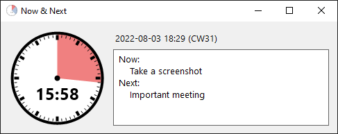

# Now And Next

_Inspired by [now_and_next](https://github.com/sweavo/now_and_next) by Steve
Carter. Some of this description is from his version._

# Intro

Put time in your visual field so that you are not perpetually late for meetings.

# Purpose

You can go read the original purpose statement
[here](https://github.com/sweavo/now_and_next#instructions).

The user story from the original is:

> **As a** person with time-blindness who has to mix appointments and other
> work, 
> **I want to** be constantly reminded how long it is until my next appointment
>  
> **so that** I can manage my work and show up to meetings on time.

# Why Reimplement It In C♯?

I rewrote it in C♯ and .NET to improve the handling of integration with Outlook
(C♯ is better than Python at interacting with COM) and so it was more easily
usable for non-engineers (no need to setup Python).

It also just seemed fun to do!

# License

This project is licensed under the BSD 3-Clause License.

The original project, [now_and_next](https://github.com/sweavo/now_and_next) by
Steve Carter is licensed under the MIT Licnese.

